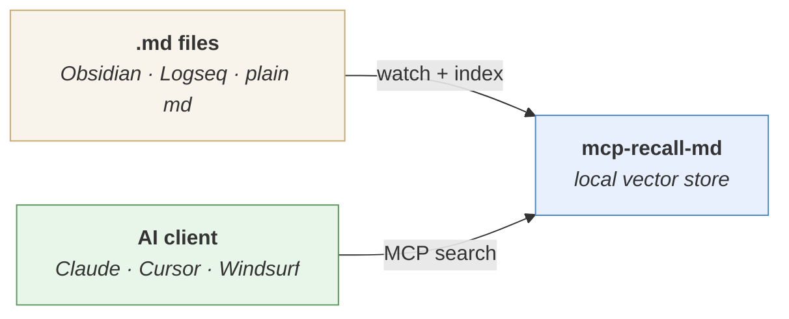

<h1 align="center">mcp-recall-md</h1>

<p align="center">
  Local semantic search for your markdown notes — via <a href="https://modelcontextprotocol.io/">MCP</a>.
</p>

<p align="center">
  <a href="https://pypi.org/project/mcp-recall-md/"></a>
  <a href="https://pypi.org/project/mcp-recall-md/"></a>
  <a href="LICENSE"></a>
</p>

<br>



> **"Search my notes about Kubernetes networking"**
>
> → finds `kubernetes-networking.md` (similarity: 0.53) — even though you phrased it differently than the note

<br>

- **Search by meaning, not keywords** — finds notes even when your wording doesn't match
- **100% offline** — no API keys, no cloud, nothing leaves your machine
- **Zero config** — point at your folders, restart your AI client, done
- **Real-time sync** — file watcher picks up changes instantly, re-embeds only what changed

---

## Quick start

Add to your MCP client config and restart:

```json
{
  "mcpServers": {
    "mcp-recall-md": {
      "command": "uvx",
      "args": ["mcp-recall-md", "--vaults", "C:/Users/you/notes"]
    }
  }
}
```

> **Config file location:** `.mcp.json` (Claude Code) · `claude_desktop_config.json` (Claude Desktop) · Cursor / Windsurf MCP settings

That's it. Your notes are searchable.

---

## Installation

The quick start above uses [`uvx`](https://docs.astral.sh/uv/) (recommended). Other options:

<details>
<summary><b>pip</b></summary>

```bash
pip install mcp-recall-md
```

```json
{
  "mcpServers": {
    "mcp-recall-md": {
      "command": "mcp-recall-md",
      "args": ["--vaults", "C:/Users/you/notes"]
    }
  }
}
```

</details>

<details>
<summary><b>Standalone .exe (no Python needed)</b></summary>

1. Download **mcp-recall-md.exe** from the [latest release](https://github.com/kalikin-artem/mcp-recall-md/releases)
2. Put it somewhere permanent (e.g. `C:\Tools\mcp-recall-md\`)

```json
{
  "mcpServers": {
    "mcp-recall-md": {
      "command": "C:/Tools/mcp-recall-md/mcp-recall-md.exe",
      "args": ["--vaults", "C:/Users/you/notes"]
    }
  }
}
```

</details>

---

## Configuration

### Multiple vaults

List all folders — each is indexed independently:

```json
"args": ["--vaults", "C:/notes/work", "C:/notes/personal", "C:/docs"]
```

### .recallignore

Drop a `.recallignore` in any vault root to exclude files. Standard `.gitignore` syntax:

```gitignore
.obsidian/
_templates/
drafts/
```

### CLI flags

| Flag | Default | Description |
|------|---------|-------------|
| `--vaults` | *(none)* | Folders to index and watch |
| `--db-path` | `~/.mcp-recall-md/db` | ChromaDB storage location |
| `--verbose` | off | Debug logging to stderr |

---

## Tools

Your AI assistant gets these tools automatically via MCP:

| Tool | Description |
|------|-------------|
| `search` | Find notes by meaning — returns ranked results with similarity scores and file paths |
| `status` | Show indexed article count and watched vaults |
| `index` | Manually store an article (for use without `--vaults`) |
| `remove` | Delete an article from the index |

Most users only interact with `search` — everything else is automatic.

---

## Troubleshooting

| Problem | Fix |
|---------|-----|
| Search returns nothing | Check that `--vaults` points to folders with `.md` files |
| First run is slow | Embedding model (~80 MB) downloads once on first use |
| Need to debug | Add `--verbose`, check `~/.mcp-recall-md/server.log` |
| Force re-index | Delete `~/.mcp-recall-md/db` and restart |

Logs: `~/.mcp-recall-md/server.log` (5 MB max, 3 rotated backups)

---

## Limitations

- **Single-chunk embedding** — large files (10k+ words) may search less precisely than shorter notes
- **English-optimized** — other languages work but with lower accuracy

---

## License

MIT
